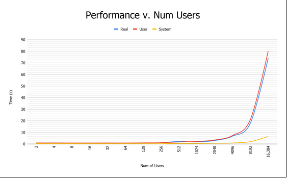
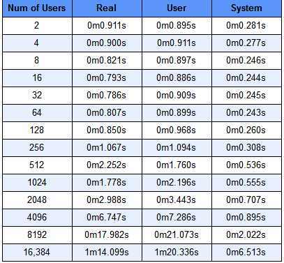
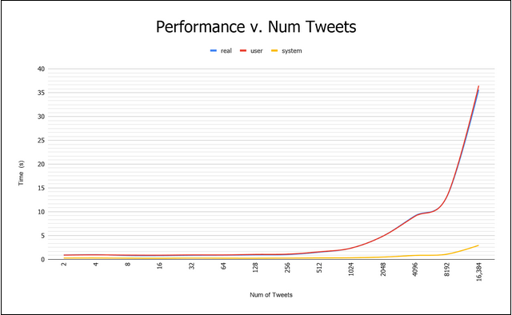
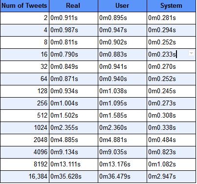
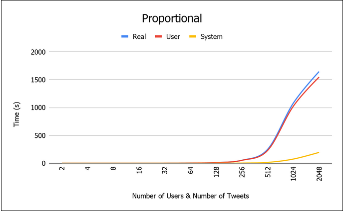
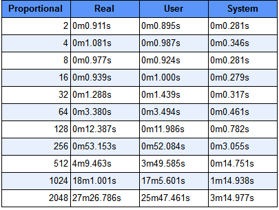

# Twitter

## About 
In this project, a program is built (using Elixir) that simlates all the functionalities of Twitter application and also test these functionalities and other use cases of the app. A functionality is added that follows zipf distribution law amongst the tweets. Moreover, log on and log off feature is implemented in the processes(represented as users) of the program. In the end, a performance analysis is done for various scenarios.

## How to run the simulation 
To run the simulation in the main directory (/LaurenceauSaxena) use:

elixir pro_j4.ex [num_users] [num_msg]

This simulation will create the  [num_users] specified from the command line. Each user will randomly subscribe to other user’s and post [num_msg] tweets. Note, because the simulation runs with predefined inputs it requires no interaction and has no outputs. Normal prompts such as asking for a password and confirming deletion of accounts are suppressed. 

## How to run the tests 
Unit Tests were created for the functionalities described below. To run the test simply use:

“mix test --seed 0” 

  

The tests must be run in a specific order so that decencies can be established such as a retweet test is not run before any users are subscribed.It is also to be noted that some tests do print to the command line such as “testing if tweet is empty it should not pass.” These tests were chosen to print, as they perform special functionality. 

## Performance Analysis
To perform first analysis, the number of tweets being sent per user is kept constant and the number of users is exponentially increased. The graph showing the real, user and system time is below,  along with a chart.

  

  

In the second analysis, the number of users sending tweets is kept constant and the number of tweets sent is exponentially increased. The graph showing the real(blue), user (red) and system time (yellow) is below along with a chart

  

  

Last tests included a proportionality test for number of users and number of tweets. This means that if there are two users, they each send two tweets; four users, they each send four tweets; eight users, they each send eight tweets and so on.

  

  

